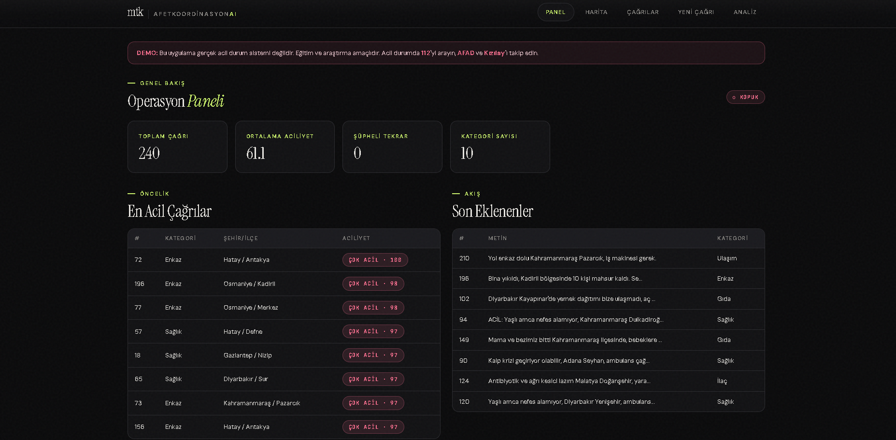
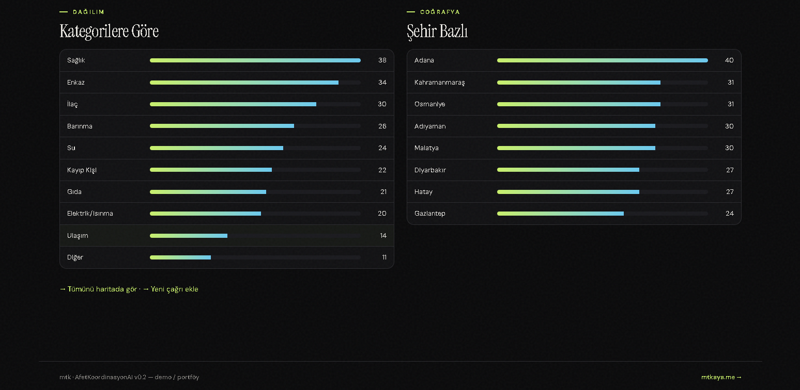
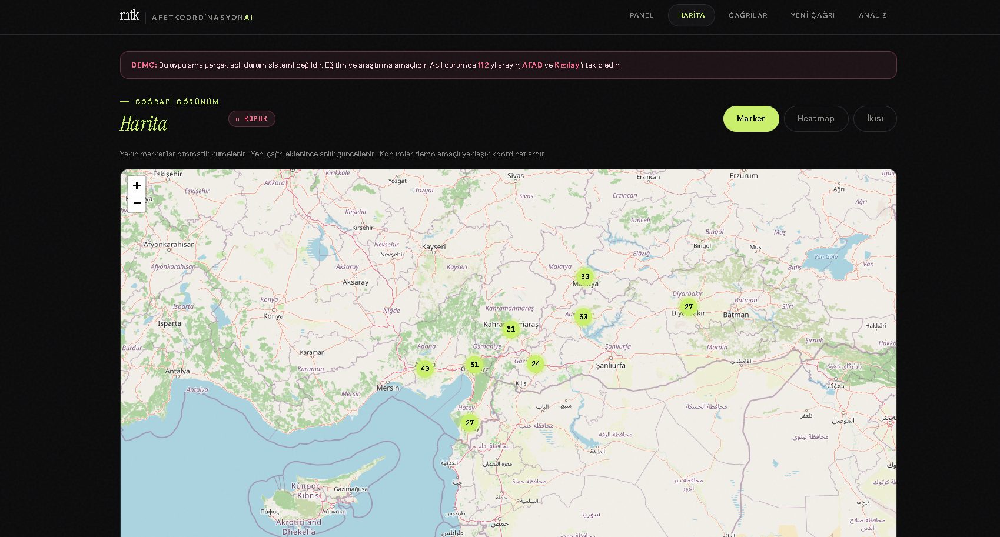
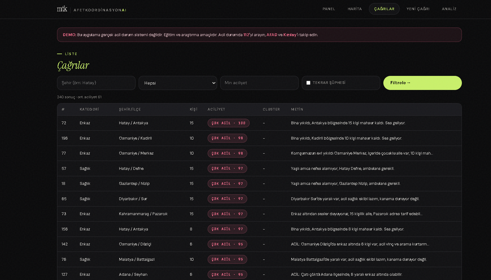
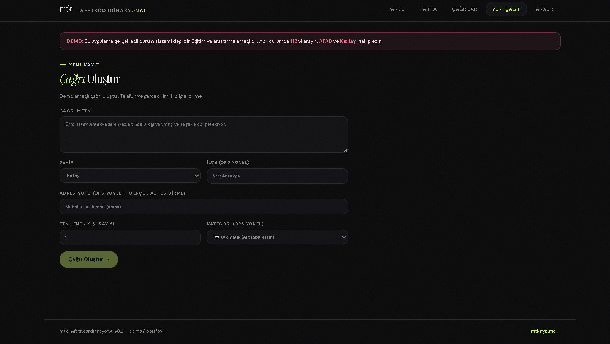
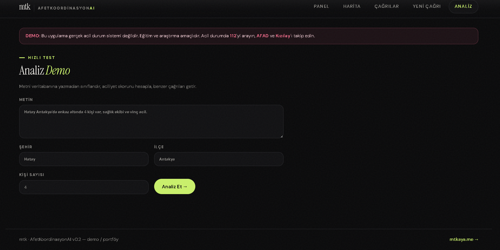

# AfetKoordinasyonAI

> Afet anında gelen yardım çağrılarını **analiz eden**, **kategorilere ayıran**, **aciliyet puanı veren**, **benzer çağrıları gruplayan** ve çağrıları **harita üzerinde görselleştiren** eğitim/demo amaçlı web uygulaması.

<p align="center">
  <a href="https://afet-koordinasyon-ai.vercel.app/"><strong>Canlı Demo</strong></a>
  ·
  <a href="./backend/README.md">Backend Dokümantasyonu</a>
  ·
  <a href="./frontend/README.md">Frontend Dokümantasyonu</a>
</p>

<p align="center">
  
  
  
  
  
</p>

---

## Önemli Uyarı

Bu proje **gerçek acil durumlarda kullanılacak resmi bir afet koordinasyon sistemi değildir**.

- Eğitim, araştırma, demo ve portföy amacıyla geliştirilmiştir.
- Veriler sentetiktir; gerçek kişi, gerçek telefon, gerçek adres veya resmi vaka bilgisi içermez.
- Üretimde, resmi kriz yönetiminde veya acil müdahale kararlarında kullanılmamalıdır.
- Gerçek acil durumda **112** aranmalı; **AFAD**, **Kızılay** ve resmi kurum duyuruları takip edilmelidir.

Bu uyarı uygulama arayüzünde de görünür şekilde gösterilir.

---

## Demo

Canlı uygulama:

```text
https://afet-koordinasyon-ai.vercel.app/
```

Uygulama; çağrı kaydı, analiz demosu, operasyon paneli, çağrı listesi, harita, marker clustering ve heatmap ekranlarından oluşur.

---

## Ekran Görüntüleri

### Operasyon Paneli

Dashboard ekranında toplam çağrı sayısı, ortalama aciliyet, şüpheli tekrar sayısı, kategori sayısı, en acil çağrılar ve son eklenen kayıtlar görüntülenir.



### Kategori ve Şehir Dağılımları

Çağrılar kategori ve şehir bazında özetlenir. Bu ekran, hangi ihtiyaçların ve hangi bölgelerin öne çıktığını hızlıca görmek için kullanılır.



### Harita Görünümü

Çağrılar Türkiye haritası üzerinde gösterilir. Marker, heatmap ve karma görünüm arasında geçiş yapılabilir. Yakın konumdaki marker'lar otomatik gruplanır.



### Çağrı Listesi

Çağrılar kategori, şehir, aciliyet ve tekrar şüphesi gibi filtrelerle listelenebilir. Operatörün kayıtları hızlı taraması için tablo görünümü kullanılır.



### Yeni Çağrı Oluşturma

Yeni çağrı ekranında çağrı metni, şehir, ilçe, demo adres notu, etkilenen kişi sayısı ve isteğe bağlı kategori bilgisi girilir. Kategori boş bırakılırsa sistem otomatik tahmin eder.



### Analiz Demo

Analiz ekranı, metni veritabanına kaydetmeden sınıflandırma, aciliyet skoru ve benzer çağrı kontrolü yapmayı sağlar.



---

## Özellikler

- **Türkçe yardım çağrısı analizi:** Serbest metin formatındaki afet çağrıları analiz edilir.
- **Kategori tahmini:** Çağrılar `enkaz`, `saglik`, `su`, `gida`, `barinma`, `ilac`, `ulasim`, `kayip_kisi`, `elektrik_isinma`, `diger` kategorilerine ayrılır.
- **0-100 aciliyet skoru:** Anahtar kelimeler, kategori ağırlığı ve etkilenen kişi sayısı üzerinden yorumlanabilir skor üretilir.
- **Benzer çağrı / duplicate tespiti:** TF-IDF ve cosine similarity ile aynı bölgeden gelen benzer çağrılar gruplanır.
- **Harita görselleştirme:** Leaflet tabanlı marker, cluster ve heatmap görünümleri bulunur.
- **Operasyon paneli:** Toplam çağrı, ortalama aciliyet, kategori dağılımı, şehir dağılımı ve son kayıtlar tek ekranda gösterilir.
- **Analiz modu:** Çağrıyı kaydetmeden model çıktısı test edilebilir.
- **Gerçek zamanlı güncelleme:** WebSocket ile yeni çağrılar dashboard ve harita tarafına anlık aktarılır.
- **Sentetik veri üretimi:** Demo için otomatik örnek afet çağrısı üretilebilir.
- **Test ve CI:** Backend testleri ve frontend build/type-check akışı GitHub Actions ile çalıştırılabilir.
- **Docker desteği:** Backend ve frontend servisleri tek komutla ayağa kaldırılabilir.

---

## Teknoloji Stack'i

### Backend

- **FastAPI** — REST API ve WebSocket servisi
- **SQLAlchemy** — ORM ve veritabanı erişimi
- **SQLite** — demo veritabanı
- **scikit-learn** — TF-IDF + Logistic Regression sınıflandırıcı
- **pandas / numpy** — sentetik veri ve model hazırlığı
- **pytest** — backend testleri

### Frontend

- **React 18**
- **Vite**
- **TypeScript**
- **React Router**
- **Leaflet / React Leaflet**
- **react-leaflet-cluster**
- **leaflet.heat**

### DevOps / Dağıtım

- **Vercel** — frontend dağıtımı
- **Render** — backend dağıtım blueprint'i
- **Docker Compose** — lokal çoklu servis çalıştırma
- **GitHub Actions** — test ve build kontrolü

---

## Mimari

```text
┌────────────────────────────────────┐
│ Frontend                           │
│ React + Vite + TypeScript          │
│ Dashboard / Harita / Formlar       │
│ Leaflet + Cluster + Heatmap        │
└──────────────────┬─────────────────┘
                   │ HTTP + WebSocket
                   ▼
┌────────────────────────────────────┐
│ Backend                            │
│ FastAPI + SQLAlchemy               │
│ REST API / WebSocket / NLP servisleri│
│ TF-IDF + Logistic Regression       │
│ Urgency Engine + Deduplication     │
└──────────────────┬─────────────────┘
                   │
                   ▼
┌────────────────────────────────────┐
│ SQLite                             │
│ help_calls tablosu                 │
│ synthetic_calls.csv                │
│ classifier.pkl                     │
└────────────────────────────────────┘
```

Yeni bir çağrı geldiğinde sistem şu akışı izler:

1. Çağrı metni alınır.
2. NLP sınıflandırıcısı kategori tahmini yapar.
3. Kural tabanlı motor aciliyet skorunu hesaplar.
4. Benzer çağrılar TF-IDF cosine similarity ile kontrol edilir.
5. Benzer kayıt varsa cluster ilişkisi kurulur.
6. Koordinat yoksa şehir/ilçe için yaklaşık demo koordinatı atanır.
7. Kayıt dashboard ve harita ekranlarına WebSocket üzerinden iletilir.

---

## Proje Yapısı

```text
afet-koordinasyon-ai/
├── backend/
│   ├── app/
│   │   ├── main.py
│   │   ├── models/
│   │   ├── routes/
│   │   ├── schemas/
│   │   └── services/
│   ├── data/
│   ├── tests/
│   ├── requirements.txt
│   └── README.md
├── frontend/
│   ├── src/
│   │   ├── components/
│   │   ├── pages/
│   │   ├── services/
│   │   └── types/
│   ├── package.json
│   └── README.md
├── images/
│   ├── 1.png
│   ├── 2.png
│   ├── 3.png
│   ├── 4.png
│   ├── 5.png
│   └── 6.png
├── docker-compose.yml
├── render.yaml
├── DEPLOY.md
└── README.md
```

---

## Kurulum

### Gereksinimler

- Python 3.10+
- Node.js 18+
- npm
- Docker ve Docker Compose opsiyonel

Projeyi klonlayın:

```bash
git clone https://github.com/mehmettalhakaya/afet-koordinasyon-ai.git
cd afet-koordinasyon-ai
```

---

## Backend Çalıştırma

```bash
cd backend

python -m venv .venv

# Windows
.venv\Scripts\activate

# macOS / Linux
source .venv/bin/activate

pip install -r requirements.txt

# Sentetik demo verisi üret
python -m data.generate_synthetic_data

# API sunucusunu başlat
uvicorn app.main:app --reload --port 8000
```

Backend:

```text
http://localhost:8000
```

Swagger dokümantasyonu:

```text
http://localhost:8000/docs
```

Testleri çalıştırmak için:

```bash
pytest
```

---

## Frontend Çalıştırma

```bash
cd frontend
npm install
npm run dev
```

Frontend:

```text
http://localhost:5173
```

Development modunda frontend, `/api` ve `/health` isteklerini backend'e proxy üzerinden yönlendirir.

Production build:

```bash
npm run build
```

Type-check + build:

```bash
npm run build:strict
```

---

## Docker ile Çalıştırma

Repo kök dizininde:

```bash
docker compose up --build
```

Servisler:

```text
Frontend: http://localhost:5173
Backend:  http://localhost:8000
```

---

## API Endpointleri

| Method | Path | Açıklama |
|---|---|---|
| `GET` | `/` | Servis adı, versiyon ve demo uyarısı |
| `GET` | `/health` | Servis ve model sağlık kontrolü |
| `GET` | `/api/calls` | Çağrıları filtreli listeleme |
| `GET` | `/api/calls/{id}` | Tek çağrı detayı |
| `POST` | `/api/calls` | Yeni çağrı oluşturma, sınıflandırma, skor ve dedup |
| `POST` | `/api/analyze` | Veritabanına yazmadan analiz |
| `GET` | `/api/dashboard` | Dashboard istatistikleri |
| `POST` | `/api/retrain` | Sınıflandırıcıyı yeniden eğitme |
| `WS` | `/ws/calls` | Yeni çağrı yayın akışı |

Örnek çağrı oluşturma isteği:

```bash
curl -X POST http://localhost:8000/api/calls \
  -H "Content-Type: application/json" \
  -d '{
    "text": "Hatay Antakya da enkaz altında 3 kişi var, vinç ve sağlık ekibi gerekiyor.",
    "city": "Hatay",
    "district": "Antakya",
    "people_count": 3
  }'
```

---

## AI / NLP Yaklaşımı

Bu proje klasik makine öğrenmesi yaklaşımıyla hızlı, yorumlanabilir ve demo için düşük maliyetli bir NLP hattı kurar.

- **Vektörleştirme:** TF-IDF
- **Model:** Logistic Regression
- **Benzerlik:** Cosine similarity
- **Veri:** Sentetik Türkçe afet çağrıları
- **Amaç:** Kategori tahmini, aciliyet skorlaması ve tekrar tespiti

Bu yaklaşım gerçek afet verisi için nihai çözüm değildir. Gerçek dünyada daha büyük veri, insan doğrulaması, güvenlik katmanları, yanlış bilgi tespiti ve kurumsal entegrasyon gerekir.

---

## Aciliyet Skoru

Aciliyet skoru 0 ile 100 arasında hesaplanır.

Temel mantık:

```text
skor =
  taban puan
  + anahtar kelime ağırlıkları
  + kategori ağırlığı
  + kişi sayısı bonusu
```

Örnek yüksek öncelikli sinyaller:

- `enkaz`
- `mahsur`
- `nefes alamıyor`
- `kanama`
- `bebek`
- `çocuk`
- `acil`
- yüksek kişi sayısı

Skor bantları:

| Skor | Seviye |
|---|---|
| 80-100 | Çok acil |
| 50-79 | Yüksek |
| 20-49 | Orta |
| 0-19 | Düşük |

---

## Duplicate / Cluster Mantığı

Benzer veya tekrar olabilecek çağrılar şu mantıkla tespit edilir:

1. Yeni çağrı geldiğinde son çağrılar alınır.
2. Metinler TF-IDF ile vektörleştirilir.
3. Yeni çağrı ile eski çağrılar arasında cosine similarity hesaplanır.
4. Aynı şehir/ilçe eşleşmesi varsa yerel benzerlik etkisi artırılır.
5. Eşik üstündeki çağrılar aynı cluster'a bağlanır.
6. Çok yüksek benzerlikte `duplicate_suspected` işaretlenir.

Bu sayede aynı olay için farklı kişilerden gelen benzer bildirimler tekil olay kümeleri halinde takip edilebilir.

---

## Dağıtım Notları

Frontend Vercel üzerinde, backend ise Render üzerinde çalışacak şekilde yapılandırılabilir.

Render blueprint dosyası:

```text
render.yaml
```

Frontend environment değişkeni örneği:

```text
VITE_API_BASE_URL=https://backend-domaininiz.onrender.com
```

Backend CORS ayarında Vercel domaini izinli olmalıdır.

Daha ayrıntılı dağıtım adımları için:

```text
DEPLOY.md
```

---

## Test

Backend:

```bash
cd backend
pytest
```

Frontend:

```bash
cd frontend
npm run lint
npm run build
```

---

## Geliştirme Fikirleri

- Multi-label sınıflandırma
- BERTurk veya benzeri Türkçe transformer modeli
- Gerçek zamanlı görev/ekip atama modülü
- Rol bazlı kullanıcı sistemi
- Anomali ve yanlış bilgi tespiti
- Offline-first mobil uygulama
- FAISS veya hnswlib ile daha hızlı büyük ölçekli benzerlik araması
- Kurumsal entegrasyon için ayrı adapter katmanı
- Operasyon kayıtları için denetim/audit log sistemi

---

## Sorumlu Kullanım

Bu proje afet teknolojileri, kriz bilişimi ve Türkçe NLP alanında portföy/demonstrasyon amacıyla hazırlanmıştır. Gerçek afet yönetimi; resmi kurumlar, doğrulanmış veriler, saha ekipleri, hukuki süreçler, güvenlik mekanizmaları ve insan denetimi gerektirir.

Bu nedenle proje yalnızca teknik demo olarak değerlendirilmelidir.

---

## Lisans

Lisans bilgisi için repo içerisindeki lisans dosyasını kontrol edin. Lisans dosyası eklenmemişse, kodun kullanım koşulları netleşene kadar varsayılan olarak tüm hakları saklı kabul edilmelidir.

---

## Geliştirici

**Mehmet Talha Kaya**

- GitHub: [@mehmettalhakaya](https://github.com/mehmettalhakaya)
- Demo: [afet-koordinasyon-ai.vercel.app](https://afet-koordinasyon-ai.vercel.app/)
